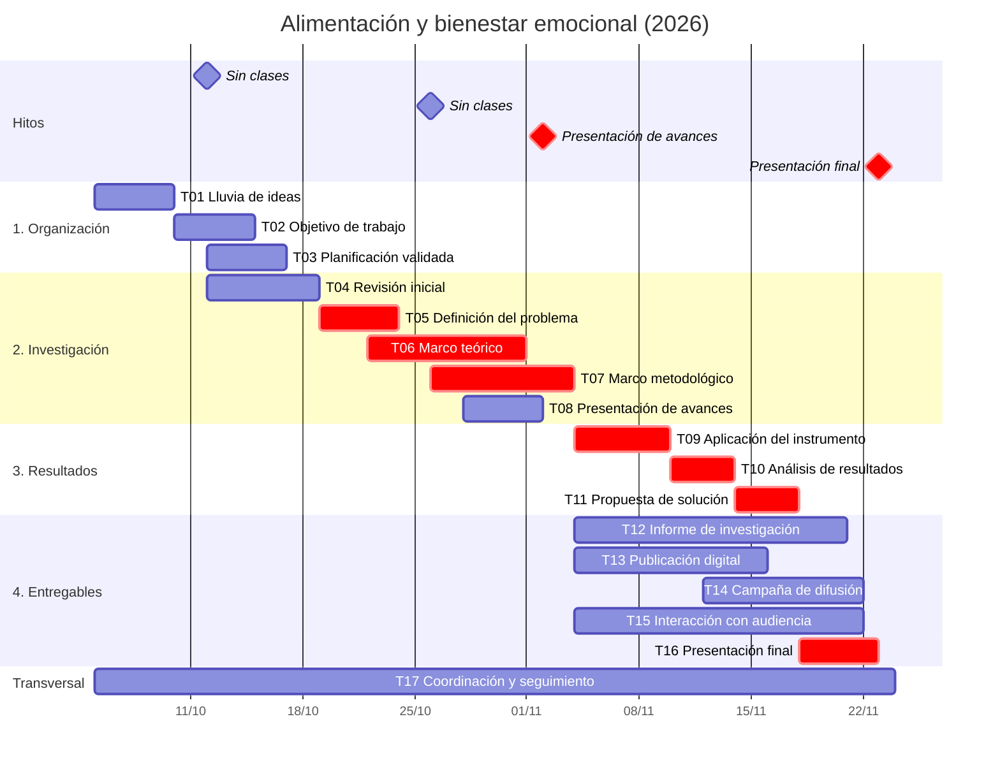

# 5. Carta Gantt

Corresponde a ppt-9, diapositivas 9–10: "Realizar una planificación de las tareas de acuerdo al tiempo disponible para ejecutar el proyecto, considerando cuánto tarda cada uno y las actividades previas necesarias". Incluye los componentes que pide la diapositiva 10: **tareas, fechas de inicio y fin, barras, escala de tiempo e hitos**.

**Estado:** versión 1, completa. Queda sujeta a la [validación del equipo](README.md#validación-del-equipo). Las fechas salen de la [estimación de tiempos](03-estimacion-de-tiempos.md), que ya incluye la holgura, y los responsables de la [RACI](04-matriz-raci.md).

## Diagrama

El diagrama se ve como gráfico en GitHub y en la vista previa de Markdown de VS Code.

## Escala semanal

Las semanas van de lunes a domingo. ■ indica trabajo **previsto**, no realizado. ◆ indica un hito.

| Semana | Fechas | Condición |
| --- | --- | --- |
| S1 | 05–11/10 | |
| S2 | 12–18/10 | Sin clases el 12/10 |
| S3 | 19–25/10 | |
| S4 | 26/10–01/11 | Sin clases el 26/10 |
| S5 | 02–08/11 | ◆ 02/11: presentación de avances |
| S6 | 09–15/11 | |
| S7 | 16–22/11 | |
| S8 | 23/11 | ◆ 23/11: presentación final. No se planifica trabajo posterior |

| ID | Tarea | Inicio | Fin | Depende de | A | S1 | S2 | S3 | S4 | S5 | S6 | S7 | S8 |
| --- | --- | --- | --- | --- | --- | :-: | :-: | :-: | :-: | :-: | :-: | :-: | :-: |
| T01 | Lluvia de ideas | 05/10 | 09/10 | Inicio | José | ■ | | | | | | | |
| T02 | Objetivo de trabajo | 10/10 | 14/10 | T01 | Claudio | ■ | ■ | | | | | | |
| T03 | Planificación validada | 12/10 | 16/10 | T01 | Rodolfo | | ■ | | | | | | |
| T04 | Revisión inicial | 12/10 | 18/10 | T01 | Álvaro | | ■ | | | | | | |
| T05 | Definición del problema | 19/10 | 23/10 | T02, T04 | Claudio | | | ■ | | | | | |
| T06 | Marco teórico | 22/10 | 31/10 | T05 (borrador) | Álvaro | | | ■ | ■ | | | | |
| T07 | Marco metodológico | 26/10 | 03/11 | T05; T06 en curso | Isidora | | | | ■ | ■ | | | |
| T08 | Presentación de avances | 28/10 | 01/11 | T05; estado de T07 | Rodolfo | | | | ■ | ◆ | | | |
| T09 | Aplicación del instrumento | 04/11 | 09/11 | T07 | Isidora | | | | | ■ | ■ | | |
| T10 | Análisis de resultados | 10/11 | 13/11 | T09 | Isidora | | | | | | ■ | | |
| T11 | Propuesta de solución | 14/11 | 17/11 | T10 | José | | | | | | ■ | ■ | |
| T12 | Informe de investigación | 04/11 | 20/11 | T05, T06; cierre tras T11 | Claudio | | | | | ■ | ■ | ■ | |
| T13 | Publicación digital | 04/11 | 15/11 | T06; incorpora T10 | Paula | | | | | ■ | ■ | | |
| T14 | Campaña de difusión | 12/11 | 21/11 | Difusión tras T13 | Paula | | | | | | ■ | ■ | |
| T15 | Interacción con audiencia | 04/11 | 21/11 | Modalidad elegida; T13 | Rodolfo | | | | | ■ | ■ | ■ | |
| T16 | Presentación final | 18/11 | 22/11 | T11; cierre de T12 y T15 | Álvaro | | | | | | | ■ | ◆ |
| T17 | Coordinación y seguimiento | 05/10 | 23/11 | Toda la duración | José | ■ | ■ | ■ | ■ | ■ | ■ | ■ | ■ |

## Notas sobre dependencias

- **Superposiciones planificadas:**
  - T06 parte con un borrador del problema (T05).
  - T07 avanza en paralelo al marco teórico.
  - En la presentación de avances (T08), el método se muestra en su estado real. No se presenta como terminado si no lo está.
- **Antes del 23/11 tienen que estar cerrados** el informe (T12), la campaña (T14) y la interacción (T15).
- La campaña (T14) solo invita a visitar la publicación cuando la publicación (T13) ya está revisada y en línea, desde el 16/11.
- La plataforma (T13) y la modalidad de interacción (T15) se deciden en la semana del 04/11.
- Las barras marcadas como `crit` en el diagrama forman la ruta crítica propuesta.
